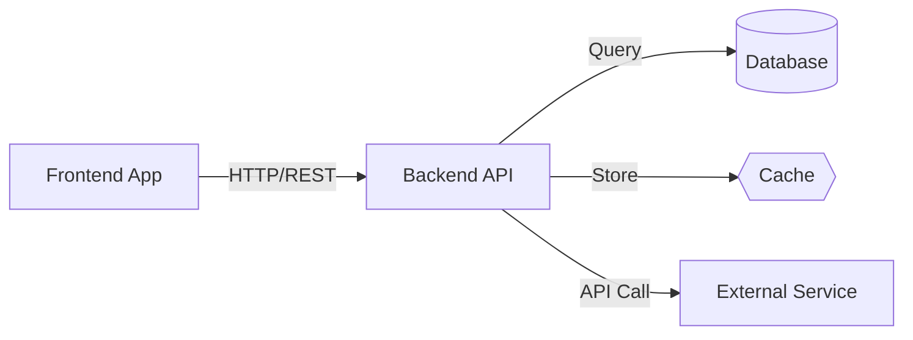

# QueryNet Architecture Documentation

This directory contains comprehensive Mermaid architecture diagrams for the QueryNet Q&A platform, visualizing system components, data flow, deployment architecture, and user interactions.

## 📁 Architecture Diagrams

### 🏗️ [System Architecture](./system-architecture.md)
High-level system architecture showing frontend, backend, database, and external services.

### 🔄 [Data Flow Architecture](./data-flow.md)
User interactions, API calls, database operations, and real-time updates flow.

### 🚀 [Deployment Architecture](./deployment-architecture.md)
CI/CD pipeline, containerization, cloud services, and production infrastructure.

### 🔐 [Authentication Flow](./auth-flow.md)
User authentication, JWT token flow, and authorization mechanisms.

### 📱 [Frontend Architecture](./frontend-architecture.md)
React component hierarchy, state management, and routing structure.

### ⚙️ [Backend Architecture](./backend-architecture.md)
Express.js API structure, middleware, controllers, and database models.

### 🗄️ [Database Schema](./database-schema.md)
MongoDB collections, relationships, and data modeling.

### 🔄 [User Journey Flow](./user-journey.md)
Complete user experience from registration to question answering.

## 🎯 Architecture Overview

QueryNet follows a modern microservices-inspired architecture with clear separation of concerns:

```
Frontend (React) ←→ API Gateway ←→ Backend Services ←→ Database (MongoDB)
                              ↓
                         External Services
                    (Auth, Cache, Notifications)
```

### Key Architectural Principles

1. **Separation of Concerns** - Clear boundaries between presentation, business logic, and data layers
2. **Scalability** - Horizontally scalable components with stateless design
3. **Security** - Authentication, authorization, and data protection at every layer
4. **Performance** - Caching, optimization, and efficient data access patterns
5. **Maintainability** - Clean code, documentation, and testing strategies

### Technology Stack

**Frontend Tier**
- React 19.1 + TypeScript
- Vite for build tooling
- Tailwind CSS + Radix UI
- React Router for navigation

**Backend Tier**
- Node.js + Express.js
- TypeScript for type safety
- JWT for authentication
- Redis for caching

**Data Tier**
- MongoDB for primary data
- Redis for sessions/cache
- File storage for uploads

**Infrastructure**
- Docker for containerization
- GitHub Actions for CI/CD
- Vercel for frontend hosting
- Railway for backend hosting

## 🔍 How to Read the Diagrams

Each architecture diagram uses Mermaid syntax and includes:

- **Components**: Boxes representing services, applications, or data stores
- **Connections**: Arrows showing data flow and communication
- **Groupings**: Related components grouped by function or layer
- **Icons**: Visual indicators for different types of components

### Diagram Legend



## 🚀 Quick Navigation

### For Developers
- Start with [System Architecture](./system-architecture.md) for overall understanding
- Review [Frontend Architecture](./frontend-architecture.md) for UI development
- Study [Backend Architecture](./backend-architecture.md) for API development
- Check [Database Schema](./database-schema.md) for data modeling

### For DevOps Engineers
- Focus on [Deployment Architecture](./deployment-architecture.md)
- Review CI/CD workflows and containerization
- Study scaling and monitoring strategies

### For Product Managers
- Begin with [User Journey Flow](./user-journey.md)
- Understand [Authentication Flow](./auth-flow.md)
- Review feature interactions and user experience

### For Security Engineers
- Study [Authentication Flow](./auth-flow.md)
- Review security boundaries in system architecture
- Analyze data protection mechanisms

## 📊 Architecture Metrics

### Performance Targets
- **Frontend**: < 2s initial load time
- **API Response**: < 200ms average response time
- **Database**: < 100ms query execution time
- **Uptime**: 99.9% availability target

### Scalability Metrics
- **Concurrent Users**: 10,000+ supported
- **Questions per Day**: 100,000+ capacity
- **Storage**: Petabyte-scale document storage
- **API Calls**: 1M+ requests per day

### Security Standards
- **Authentication**: Multi-factor authentication support
- **Encryption**: TLS 1.3 in transit, AES-256 at rest
- **Authorization**: Role-based access control (RBAC)
- **Compliance**: GDPR and SOC 2 compliant

## 🔧 Development Guidelines

### Architecture Decision Records (ADRs)

When making significant architectural changes:

1. **Document the Decision** - Create an ADR explaining the choice
2. **Consider Alternatives** - Evaluate multiple solutions
3. **Impact Assessment** - Analyze effects on existing systems
4. **Migration Strategy** - Plan implementation approach

### Code Organization

```
QueryNet/
├── frontend/              # React application
│   ├── src/components/    # Reusable UI components
│   ├── src/pages/         # Route-based pages
│   ├── src/contexts/      # State management
│   └── src/lib/           # Utilities and helpers
├── backend/               # Node.js API
│   ├── src/controllers/   # Request handlers
│   ├── src/models/        # Data models
│   ├── src/middleware/    # Express middleware
│   └── src/routes/        # API route definitions
├── docs/architecture/     # This documentation
└── docker/               # Container configurations
```

### Testing Strategy

- **Unit Tests**: 90%+ coverage for business logic
- **Integration Tests**: API endpoint testing
- **E2E Tests**: Critical user journey validation
- **Performance Tests**: Load and stress testing

## 📈 Monitoring and Observability

### Application Monitoring
- **Logs**: Structured logging with Winston
- **Metrics**: Custom business metrics tracking
- **Alerts**: Real-time error and performance alerts
- **Dashboards**: Grafana visualization

### Infrastructure Monitoring
- **Health Checks**: Service availability monitoring
- **Resource Usage**: CPU, memory, disk monitoring
- **Network**: Latency and throughput tracking
- **Security**: Intrusion detection and analysis

## 🔄 Continuous Improvement

### Regular Architecture Reviews
- **Monthly**: Performance and security reviews
- **Quarterly**: Technology stack evaluation
- **Annually**: Complete architecture assessment

### Evolution Strategy
- **Incremental Changes**: Small, frequent improvements
- **Backward Compatibility**: Maintain API versions
- **Feature Flags**: Safe deployment of new features
- **A/B Testing**: Data-driven architecture decisions

---

*This architecture documentation is living and evolves with the QueryNet platform. Last updated: January 2024*
