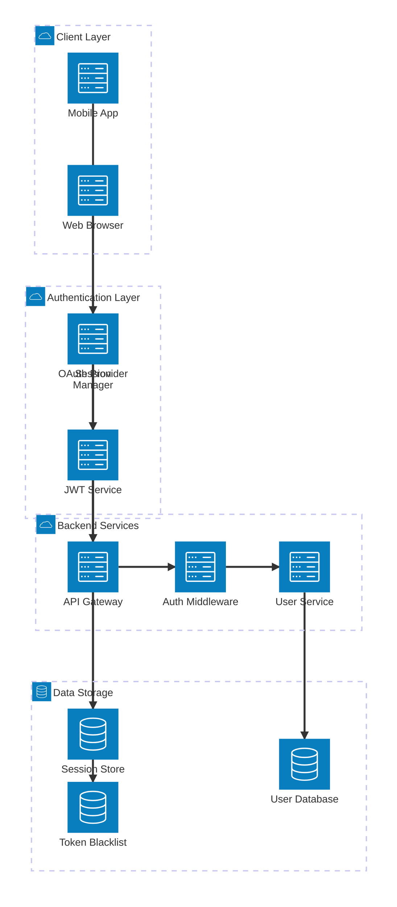
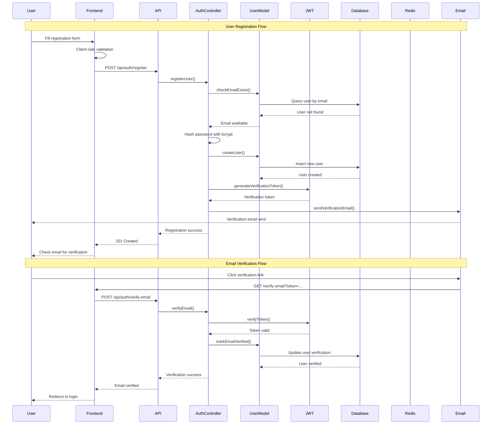
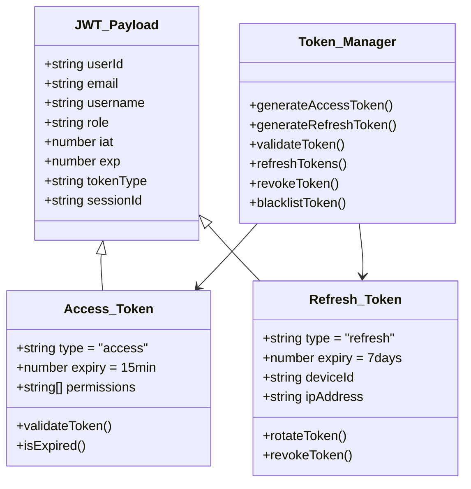
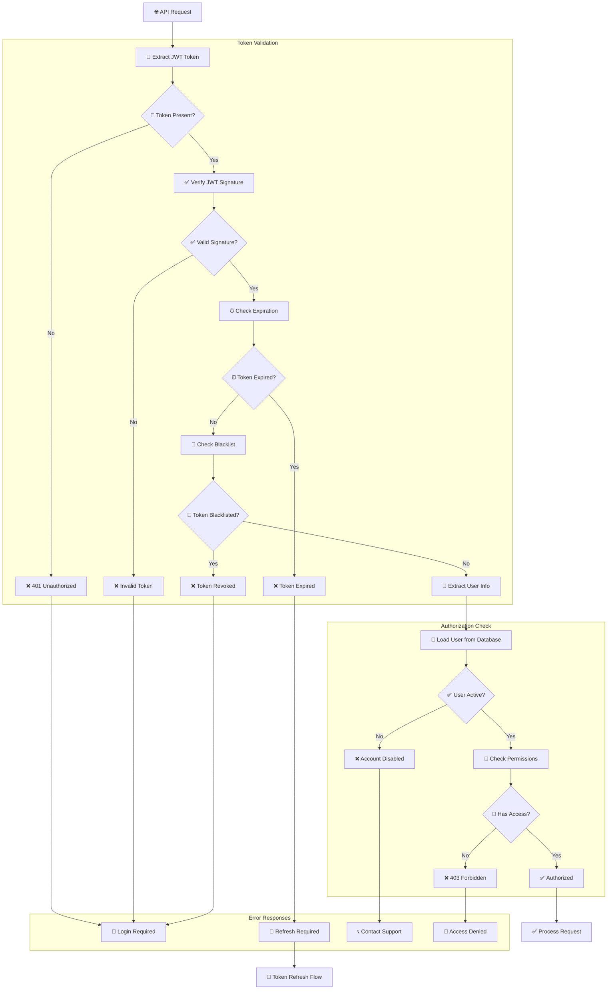
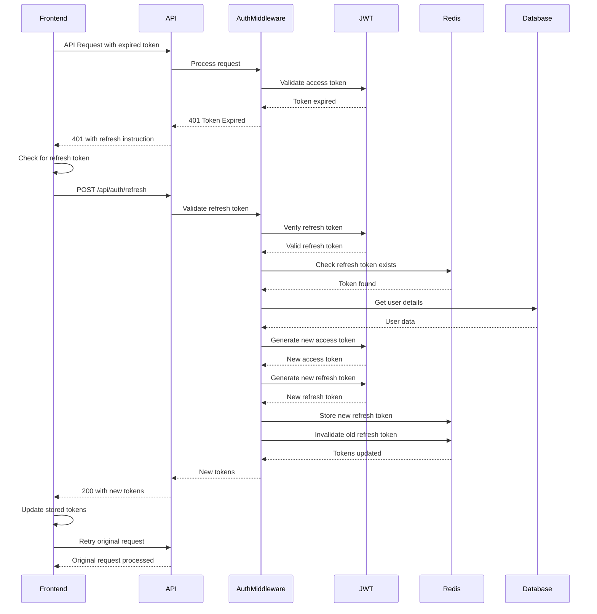
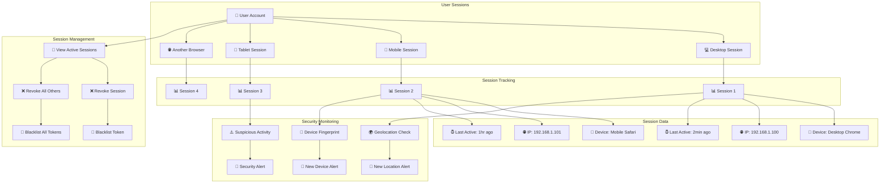
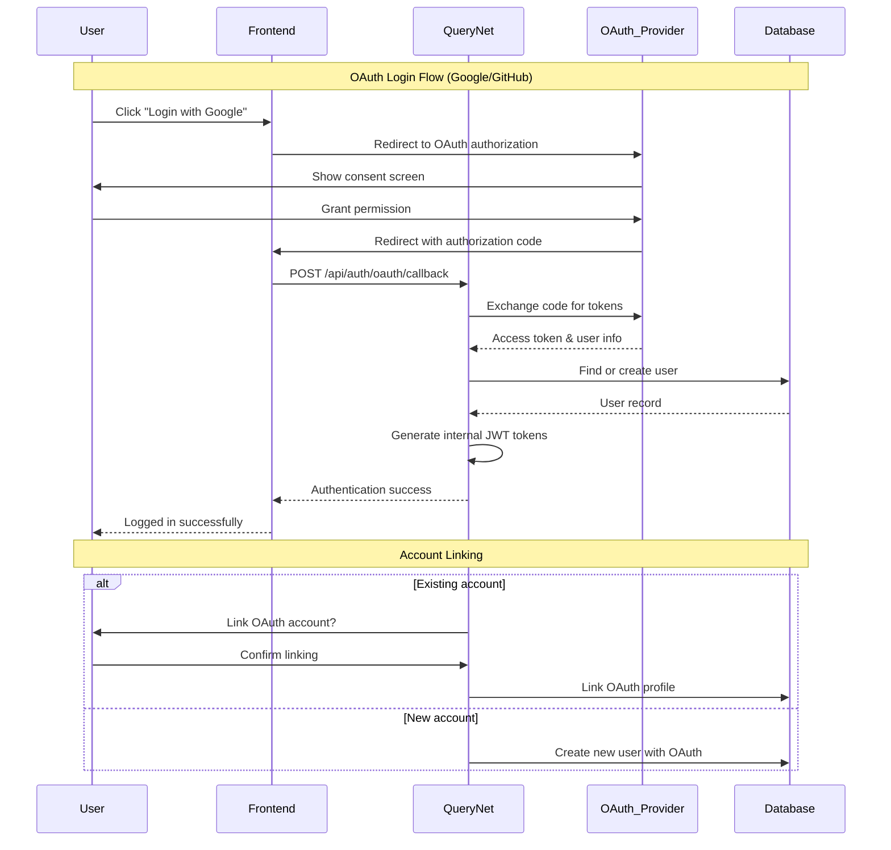
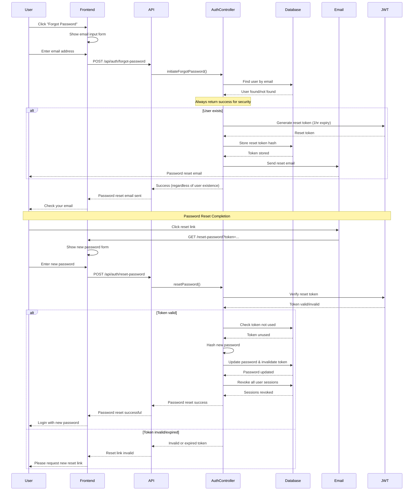

# Authentication Flow

This document details the complete authentication and authorization system for QueryNet, including JWT token management, security measures, and user session handling.

## Authentication Architecture Overview



## Complete Authentication Flow



## Login & JWT Token Flow

```mermaid
flowchart TD
    User_Login[👤 User Login Attempt] --> Credentials[🔑 Email/Password]
    
    subgraph "Client-Side Validation"
        Credentials --> Email_Format[📧 Email Format Check]
        Email_Format --> Password_Length[🔒 Password Length Check]
        Password_Length --> Submit_Valid[✅ Submit if Valid]
    end
    
    subgraph "Server-Side Authentication"
        Submit_Valid --> Find_User[👤 Find User in Database]
        Find_User --> User_Exists{🔍 User Exists?}
        User_Exists -->|No| Auth_Failure[❌ Authentication Failed]
        User_Exists -->|Yes| Check_Verified[✅ Check Email Verified]
        
        Check_Verified --> Verified{📧 Email Verified?}
        Verified -->|No| Verification_Required[📧 Verification Required]
        Verified -->|Yes| Password_Check[🔒 Password Verification]
        
        Password_Check --> Hash_Compare[🔐 bcrypt.compare()]
        Hash_Compare --> Match{✅ Password Match?}
        Match -->|No| Auth_Failure
        Match -->|Yes| Generate_Tokens[🎫 Generate Tokens]
    end
    
    subgraph "Token Generation"
        Generate_Tokens --> Access_Token[🎫 Access Token (15min)]
        Generate_Tokens --> Refresh_Token[🔄 Refresh Token (7 days)]
        Access_Token --> JWT_Payload[📋 JWT Payload]
        Refresh_Token --> Redis_Store[🔴 Store in Redis]
    end
    
    subgraph "Response & Storage"
        JWT_Payload --> HTTP_Only_Cookie[🍪 HTTP-Only Cookie]
        Redis_Store --> Session_Data[📊 Session Data]
        HTTP_Only_Cookie --> Auth_Success[✅ Authentication Success]
        Session_Data --> Auth_Success
    end
    
    Auth_Failure --> Error_Response[❌ Error Response]
    Verification_Required --> Resend_Email[📧 Resend Verification]
    Auth_Success --> User_Dashboard[📊 User Dashboard]
```

## JWT Token Structure & Management



## Authorization & Permission System



## Token Refresh Flow



## Multi-Device Session Management



## OAuth Integration (Future)



## Security Measures & Threat Protection

```mermaid
flowchart TD
    subgraph "Input Security"
        User_Input[👤 User Input] --> Sanitization[🧼 Input Sanitization]
        Sanitization --> XSS_Prevention[🛡️ XSS Prevention]
        XSS_Prevention --> CSRF_Protection[🛡️ CSRF Protection]
        CSRF_Protection --> SQL_Injection[🛡️ SQL Injection Prevention]
    end
    
    subgraph "Authentication Security"
        Password_Policy[🔒 Password Policy] --> Strong_Passwords[💪 Strong Passwords]
        Strong_Passwords --> Hash_Storage[🔐 bcrypt Hashing]
        Hash_Storage --> Salt_Rounds[🧂 12 Salt Rounds]
        Salt_Rounds --> Rate_Limiting[⏱️ Rate Limiting]
    end
    
    subgraph "Session Security"
        JWT_Security[🎫 JWT Security] --> Short_Expiry[⏰ Short Access Token Expiry]
        Short_Expiry --> Token_Rotation[🔄 Token Rotation]
        Token_Rotation --> Secure_Storage[🔒 Secure Storage]
        Secure_Storage --> HTTP_Only[🍪 HTTP-Only Cookies]
    end
    
    subgraph "Monitoring & Detection"
        Failed_Attempts[❌ Failed Login Attempts] --> Account_Lockout[🔒 Account Lockout]
        Account_Lockout --> Suspicious_Activity[⚠️ Suspicious Activity Detection]
        Suspicious_Activity --> IP_Blocking[🚫 IP Blocking]
        IP_Blocking --> Security_Alerts[🚨 Security Alerts]
    end
    
    subgraph "Data Protection"
        Data_Encryption[🔒 Data Encryption] --> TLS_Transit[🔐 TLS in Transit]
        TLS_Transit --> AES_Rest[🔐 AES at Rest]
        AES_Rest --> Key_Management[🗝️ Key Management]
        Key_Management --> Backup_Security[💾 Secure Backups]
    end
```



## Password Reset Flow



## Security Metrics & Monitoring

### Authentication Metrics
- **Login Success Rate**: > 95%
- **Failed Login Attempts**: < 5% of total attempts
- **Account Lockouts**: < 1% of active users
- **Password Reset Requests**: < 2% of users per month

### Token Security
- **JWT Token Compromises**: 0 per month
- **Token Refresh Success**: > 99%
- **Session Duration**: Average 2 hours
- **Multi-device Sessions**: Average 2.3 per user

### Security Incidents
- **Brute Force Attempts**: Blocked automatically
- **Suspicious Login Alerts**: < 0.1% false positives
- **Account Takeover Attempts**: 0 successful attempts
- **Data Breach Incidents**: 0 tolerance policy

---

*This authentication flow documentation ensures secure, user-friendly access control for the QueryNet platform.*
