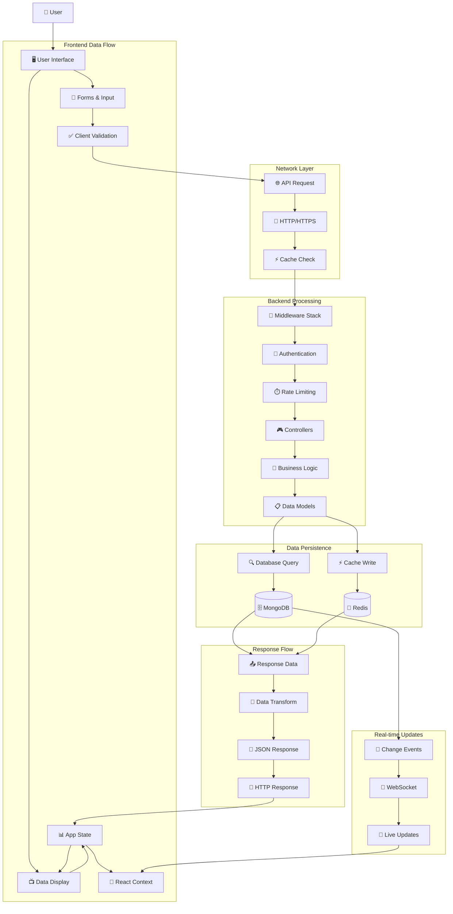
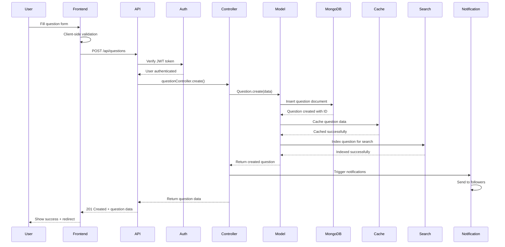
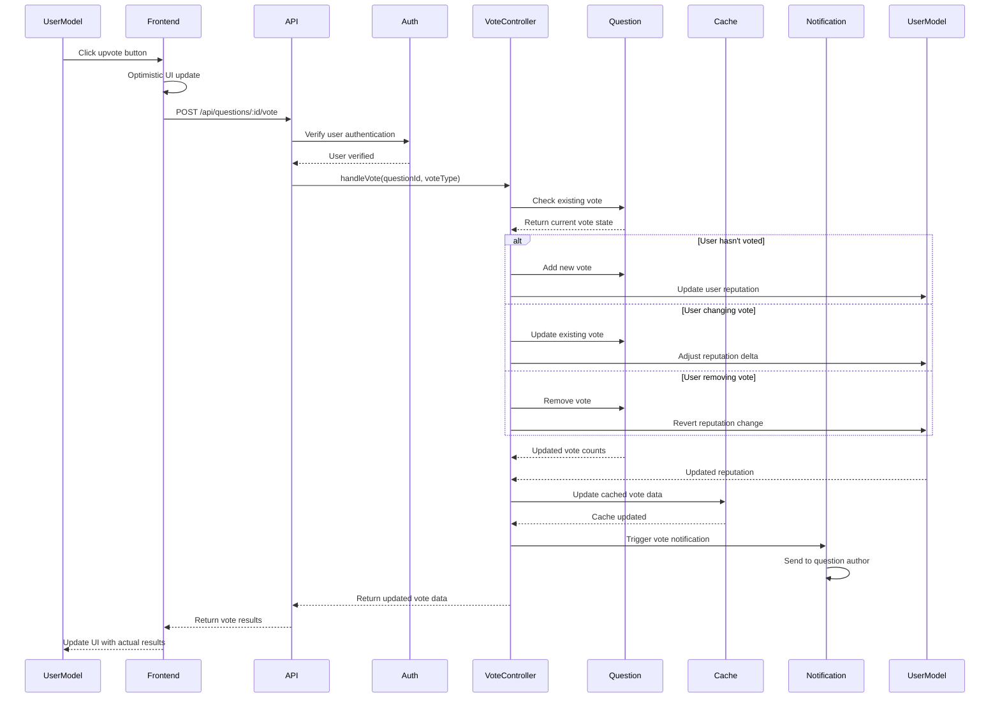
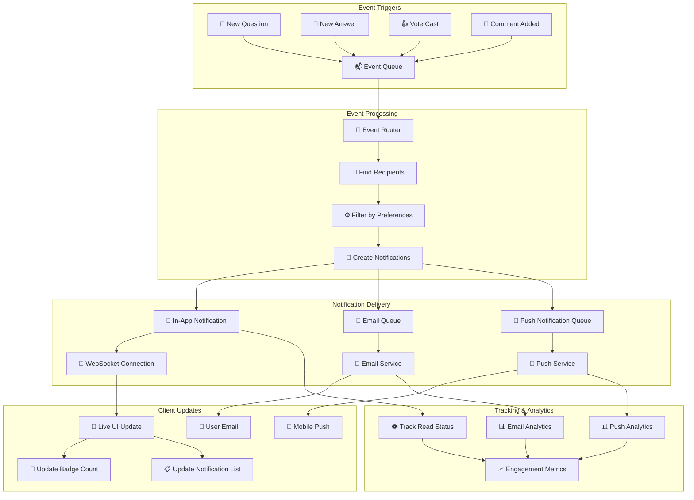
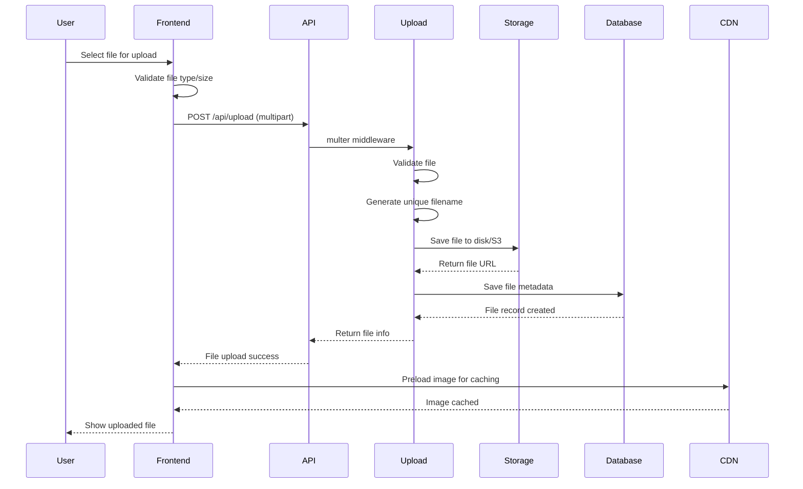
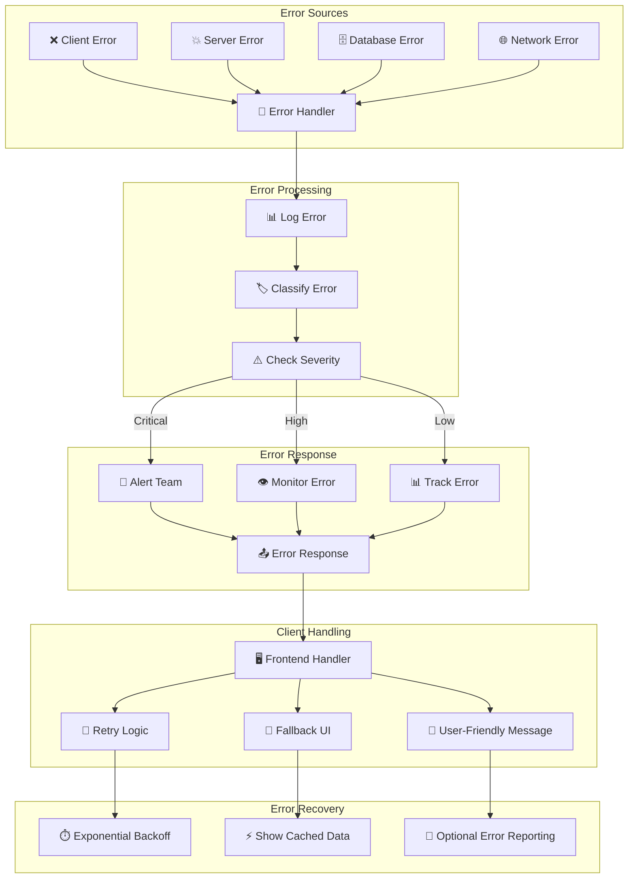
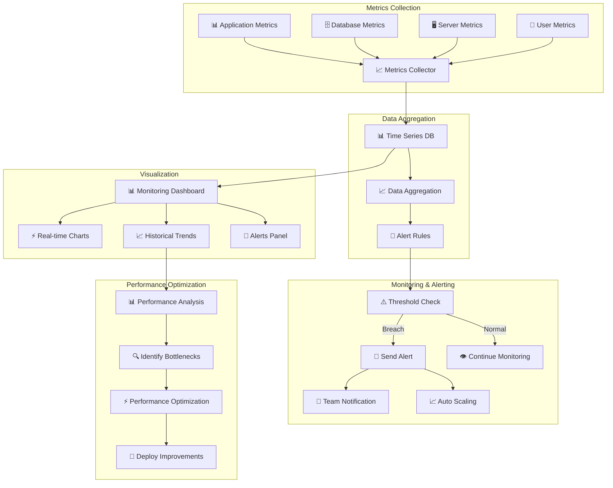

# Data Flow Architecture

This document illustrates how data flows through the QueryNet system, from user interactions to database operations and real-time updates.

## Complete Data Flow Overview



## Question Creation Data Flow



## User Authentication Data Flow

```mermaid
flowchart TD
    subgraph "Login Process"
        Login[📝 Login Form] --> Credentials[🔑 Email/Password]
        Credentials --> Validate[✅ Client Validation]
        Validate --> Login_API[🌐 POST /api/auth/login]
    end
    
    subgraph "Server Authentication"
        Login_API --> Password_Check[🔒 Password Verification]
        Password_Check --> Hash_Compare[🔨 bcrypt.compare()]
        Hash_Compare --> User_Data[👤 Fetch User Data]
        User_Data --> JWT_Create[🎫 Generate JWT]
        JWT_Create --> Refresh_Token[🔄 Create Refresh Token]
    end
    
    subgraph "Session Management"
        Refresh_Token --> Redis_Store[🔴 Store in Redis]
        JWT_Create --> Cookie_Set[🍪 Set HTTP Cookie]
        Cookie_Set --> Response[📤 Login Response]
    end
    
    subgraph "Client State Update"
        Response --> Auth_Context[🔐 Update Auth Context]
        Auth_Context --> User_State[👤 Set User State]
        User_State --> Redirect[🔄 Redirect to Dashboard]
    end
    
    subgraph "Subsequent Requests"
        Request[📡 API Request] --> JWT_Check[🎫 Extract JWT]
        JWT_Check --> Token_Verify[✅ Verify Token]
        Token_Verify --> User_Load[👤 Load User Data]
        User_Load --> Authorized[✅ Request Authorized]
    end
```

## Search Data Flow

```mermaid
graph TD
    subgraph "Search Input"
        User_Search[🔍 User types search] --> Search_Input[📝 Search Input]
        Search_Input --> Debounce[⏱️ Debounce (300ms)]
        Debounce --> Search_Query[🔍 Search Query]
    end
    
    subgraph "Search Processing"
        Search_Query --> Cache_Check[⚡ Check Search Cache]
        Cache_Check -->|Hit| Cached_Results[📋 Return Cached Results]
        Cache_Check -->|Miss| DB_Search[🗄️ Database Search]
        
        DB_Search --> Text_Search[📝 Text Search]
        Text_Search --> Tag_Filter[🏷️ Tag Filtering]
        Tag_Filter --> Sort_Results[📊 Sort by Relevance]
        Sort_Results --> Pagination[📄 Apply Pagination]
    end
    
    subgraph "Search Results"
        Pagination --> Format_Results[📋 Format Results]
        Cached_Results --> Format_Results
        Format_Results --> Cache_Store[⚡ Cache Results]
        Cache_Store --> Return_Results[📤 Return to Frontend]
    end
    
    subgraph "Frontend Display"
        Return_Results --> Update_State[📊 Update Search State]
        Update_State --> Render_Results[🖥️ Render Results]
        Render_Results --> Highlight_Terms[✨ Highlight Search Terms]
    end
    
    subgraph "Search Analytics"
        Search_Query --> Log_Search[📊 Log Search Query]
        Log_Search --> Analytics[📈 Search Analytics]
        Format_Results --> Track_Results[📊 Track Result Clicks]
    end
```

## Vote System Data Flow



## Real-time Notification Flow



## File Upload Data Flow



## Error Handling Data Flow



## Performance Monitoring Data Flow



## Data Flow Metrics

### Response Time Targets
- **Database Queries**: < 50ms average
- **API Endpoints**: < 200ms average
- **File Uploads**: < 2s for 10MB files
- **Search Queries**: < 100ms average
- **Real-time Updates**: < 50ms latency

### Throughput Targets
- **Concurrent Users**: 10,000+
- **API Requests**: 1,000/second
- **Database Operations**: 5,000/second
- **File Uploads**: 100/minute
- **WebSocket Connections**: 5,000+

### Data Volume Estimates
- **Questions per Day**: 10,000+
- **Answers per Day**: 30,000+
- **Comments per Day**: 50,000+
- **Votes per Day**: 100,000+
- **Search Queries per Day**: 500,000+

---

*This data flow documentation illustrates how information moves through QueryNet's architecture, ensuring efficient and reliable data processing.*
