# Deployment Architecture

This document outlines the complete deployment architecture for QueryNet, including CI/CD pipelines, containerization, cloud infrastructure, and production environments.

## CI/CD Pipeline Architecture

```mermaid
flowchart TD
    subgraph "Source Control"
        Dev[👨‍💻 Developer] --> Git[📁 Git Repository]
        Git --> PR[🔄 Pull Request]
        PR --> Review[👀 Code Review]
    end
    
    subgraph "CI Pipeline"
        Review --> Trigger[🚀 Pipeline Trigger]
        Trigger --> Checkout[📥 Code Checkout]
        Checkout --> Dependencies[📦 Install Dependencies]
        Dependencies --> Lint[🔍 ESLint & Prettier]
        Lint --> Test[🧪 Run Tests]
        Test --> Build[🏗️ Build Application]
        Build --> Security[🔒 Security Scan]
    end
    
    subgraph "Quality Gates"
        Security --> Coverage[📊 Test Coverage]
        Coverage --> Performance[⚡ Performance Tests]
        Performance --> Approval[✅ Manual Approval]
    end
    
    subgraph "CD Pipeline"
        Approval --> Docker[🐳 Build Docker Image]
        Docker --> Registry[📦 Push to Registry]
        Registry --> Deploy_Staging[🚀 Deploy to Staging]
        Deploy_Staging --> E2E_Tests[🧪 E2E Tests]
        E2E_Tests --> Deploy_Prod[🚀 Deploy to Production]
    end
    
    subgraph "Monitoring"
        Deploy_Prod --> Health_Check[🏥 Health Checks]
        Health_Check --> Rollback[🔄 Auto Rollback]
        Health_Check --> Success[✅ Deployment Success]
    end
```

## Container Architecture

## Docker Compose Local Development

## Production Infrastructure

## Multi-Environment Deployment Flow

## Zero-Downtime Deployment

```mermaid
flowchart TD
    subgraph "Current Production"
        LB[🔄 Load Balancer]
        App1[🖥️ App Server 1]
        App2[🖥️ App Server 2]
        App3[🖥️ App Server 3]
    end
    
    subgraph "Deployment Process"
        New_Image[📦 New Docker Image]
        Health_Check[🏥 Health Check]
        Traffic_Switch[🔄 Traffic Switch]
    end
    
    subgraph "Blue-Green Strategy"
        Blue_Env[🔵 Blue Environment]
        Green_Env[🟢 Green Environment]
        Validation[✅ Validation Tests]
    end
    
    LB --> App1
    LB --> App2
    LB --> App3
    
    New_Image --> Blue_Env
    Blue_Env --> Health_Check
    Health_Check --> Validation
    Validation --> Traffic_Switch
    
    Traffic_Switch --> LB
    LB -.->|Switch Traffic| Blue_Env
    
    App1 -.->|Drain Connections| Green_Env
    App2 -.->|Drain Connections| Green_Env
    App3 -.->|Drain Connections| Green_Env
```

## Environment Configuration

```mermaid
graph TB
    subgraph "Configuration Management"
        Env_Vars[🔧 Environment Variables]
        Config_Maps[📋 Configuration Maps]
        Secrets[🔒 Secrets Management]
        Feature_Flags[🚩 Feature Flags]
    end
    
    subgraph "Development"
        Dev_Config[📝 Development Config]
        Local_DB[🗄️ Local Database]
        Debug_Mode[🐛 Debug Mode]
        Hot_Reload[🔄 Hot Reload]
    end
    
    subgraph "Staging"
        Stage_Config[📝 Staging Config]
        Stage_DB[🗄️ Staging Database]
        Test_Data[🧪 Test Data]
        Performance_Monitor[📊 Performance Monitoring]
    end
    
    subgraph "Production"
        Prod_Config[📝 Production Config]
        Prod_DB[🗄️ Production Database]
        Security_Enhanced[🔒 Enhanced Security]
        Full_Monitor[📊 Full Monitoring]
    end
    
    Env_Vars --> Dev_Config
    Env_Vars --> Stage_Config
    Env_Vars --> Prod_Config
    
    Config_Maps --> Dev_Config
    Config_Maps --> Stage_Config
    Config_Maps --> Prod_Config
    
    Secrets --> Stage_Config
    Secrets --> Prod_Config
    
    Feature_Flags --> Dev_Config
    Feature_Flags --> Stage_Config
    Feature_Flags --> Prod_Config
```

## Monitoring & Observability

```mermaid
flowchart TD
    subgraph "Application Monitoring"
        App_Metrics[📊 Application Metrics]
        Custom_Metrics[📈 Custom Metrics]
        Business_Metrics[💼 Business Metrics]
    end
    
    subgraph "Infrastructure Monitoring"
        Server_Metrics[🖥️ Server Metrics]
        Container_Metrics[🐳 Container Metrics]
        Network_Metrics[🌐 Network Metrics]
    end
    
    subgraph "Logging"
        App_Logs[📝 Application Logs]
        Access_Logs[🌐 Access Logs]
        Error_Logs[❌ Error Logs]
        Audit_Logs[🔍 Audit Logs]
    end
    
    subgraph "Data Collection"
        Prometheus[📊 Prometheus]
        Fluentd[📋 Fluentd]
        Jaeger[🔍 Jaeger Tracing]
    end
    
    subgraph "Visualization"
        Grafana[📊 Grafana Dashboards]
        Kibana[🔍 Kibana Logs]
        APM[📈 APM Dashboard]
    end
    
    subgraph "Alerting"
        Alert_Rules[🚨 Alert Rules]
        Slack[💬 Slack Notifications]
        Email[📧 Email Alerts]
        PagerDuty[📞 PagerDuty]
    end
    
    App_Metrics --> Prometheus
    Custom_Metrics --> Prometheus
    Business_Metrics --> Prometheus
    
    Server_Metrics --> Prometheus
    Container_Metrics --> Prometheus
    Network_Metrics --> Prometheus
    
    App_Logs --> Fluentd
    Access_Logs --> Fluentd
    Error_Logs --> Fluentd
    Audit_Logs --> Fluentd
    
    Prometheus --> Grafana
    Fluentd --> Kibana
    Jaeger --> APM
    
    Prometheus --> Alert_Rules
    Alert_Rules --> Slack
    Alert_Rules --> Email
    Alert_Rules --> PagerDuty
```

## Security in Deployment

```mermaid
graph TD
    subgraph "Container Security"
        Base_Images[🔒 Secure Base Images]
        Vuln_Scan[🔍 Vulnerability Scanning]
        Image_Sign[✍️ Image Signing]
        Runtime_Security[🛡️ Runtime Security]
    end
    
    subgraph "Network Security"
        Network_Policies[🌐 Network Policies]
        TLS_Termination[🔒 TLS Termination]
        WAF[🛡️ Web Application Firewall]
        DDoS_Protection[🛡️ DDoS Protection]
    end
    
    subgraph "Access Control"
        RBAC[👥 Role-Based Access]
        Service_Accounts[🔑 Service Accounts]
        Secrets_Management[🔒 Secrets Management]
        API_Keys[🗝️ API Key Management]
    end
    
    subgraph "Compliance"
        Audit_Logging[📊 Audit Logging]
        Compliance_Scan[🔍 Compliance Scanning]
        Data_Encryption[🔒 Data Encryption]
        Backup_Security[💾 Secure Backups]
    end
    
    Base_Images --> Vuln_Scan
    Vuln_Scan --> Image_Sign
    Image_Sign --> Runtime_Security
    
    Network_Policies --> TLS_Termination
    TLS_Termination --> WAF
    WAF --> DDoS_Protection
    
    RBAC --> Service_Accounts
    Service_Accounts --> Secrets_Management
    Secrets_Management --> API_Keys
    
    Audit_Logging --> Compliance_Scan
    Compliance_Scan --> Data_Encryption
    Data_Encryption --> Backup_Security
```

## Backup & Disaster Recovery

## Deployment Checklist

### Pre-Deployment
- [ ] Code review completed
- [ ] All tests passing
- [ ] Security scan passed
- [ ] Performance tests passed
- [ ] Database migrations prepared
- [ ] Feature flags configured
- [ ] Monitoring alerts configured

### Deployment Process
- [ ] Blue-green deployment strategy
- [ ] Health checks configured
- [ ] Rollback plan prepared
- [ ] Database backup completed
- [ ] Load balancer configuration updated
- [ ] SSL certificates validated

### Post-Deployment
- [ ] Health checks passed
- [ ] Smoke tests completed
- [ ] Performance metrics normal
- [ ] Error rates within limits
- [ ] User acceptance testing
- [ ] Documentation updated
- [ ] Team notified

## Environment Specifications

### Development Environment
- **CPU**: 2 cores per service
- **Memory**: 4GB per service
- **Storage**: 100GB SSD
- **Database**: MongoDB single instance
- **Cache**: Redis single instance

### Staging Environment
- **CPU**: 4 cores per service
- **Memory**: 8GB per service
- **Storage**: 500GB SSD
- **Database**: MongoDB replica set
- **Cache**: Redis cluster
- **Load Balancer**: Nginx

### Production Environment
- **CPU**: 8+ cores per service
- **Memory**: 16GB+ per service
- **Storage**: 2TB+ SSD with backups
- **Database**: MongoDB sharded cluster
- **Cache**: Redis cluster with persistence
- **Load Balancer**: Multi-zone setup
- **CDN**: Global edge locations

---

*This deployment architecture ensures reliable, scalable, and secure delivery of QueryNet to production environments.*
