# System Architecture

This document provides a comprehensive overview of QueryNet's system architecture using Mermaid diagrams.

## High-Level System Architecture

## System Component Overview

### Frontend Layer
- **React Web Application**: Main user interface built with React 19, TypeScript, and Tailwind CSS
- **Mobile Application**: Future mobile app (planned)

### Backend Layer
- **Express API**: RESTful API server handling business logic
- **Authentication Service**: JWT-based authentication and authorization
- **Redis Cache**: High-performance caching layer

### Data Layer
- **MongoDB**: Primary database for application data
- **File Storage**: Static file and upload management

### External Services
- **Email Service**: Transactional email delivery
- **CDN**: Content delivery network for static assets

## Detailed System Flow

```mermaid
flowchart TD
    User[👤 User] --> Browser[🌐 Web Browser]
    Browser --> CDN[📦 CDN/Vercel]
    Browser --> API[🔧 Express API]
    
    subgraph "Frontend"
        CDN --> React[⚛️ React App]
        React --> Router[🛣️ React Router]
        Router --> Components[🧩 Components]
        Components --> Context[📊 Context/State]
    end
    
    subgraph "Backend Services"
        API --> Auth[🔐 Auth Middleware]
        API --> RateLimit[⏱️ Rate Limiting]
        API --> Controllers[🎮 Controllers]
        Controllers --> Models[📋 Models]
        Controllers --> Cache[⚡ Redis Cache]
    end
    
    subgraph "Data Layer"
        Models --> MongoDB[(🗄️ MongoDB)]
        API --> Files[(📁 File Storage)]
        Cache --> RedisDB[(⚡ Redis DB)]
    end
    
    subgraph "External Services"
        API --> Email[📧 Email Service]
        API --> Notifications[🔔 Push Notifications]
    end
    
    Browser -.->|WebSockets| API
    API -.->|Real-time| Browser
```

## Network Architecture

```mermaid
graph TB
    subgraph "Client Tier"
        Mobile[📱 Mobile App]
        Desktop[💻 Desktop Browser]
        Tablet[📱 Tablet Browser]
    end
    
    subgraph "Load Balancer / CDN"
        LB[🔄 Load Balancer]
        CDN[📦 Content Delivery Network]
    end
    
    subgraph "Application Tier"
        App1[🖥️ App Server 1]
        App2[🖥️ App Server 2] 
        App3[🖥️ App Server 3]
    end
    
    subgraph "Service Tier"
        Auth[🔐 Auth Service]
        Cache[⚡ Cache Service]
        Search[🔍 Search Service]
        Upload[📤 Upload Service]
    end
    
    subgraph "Data Tier"
        Primary[(🗄️ Primary DB)]
        Replica1[(🗄️ Read Replica 1)]
        Replica2[(🗄️ Read Replica 2)]
        FileStore[(📁 File Storage)]
    end
    
    Mobile --> LB
    Desktop --> LB
    Tablet --> LB
    
    LB --> CDN
    LB --> App1
    LB --> App2
    LB --> App3
    
    App1 --> Auth
    App1 --> Cache
    App1 --> Search
    App1 --> Upload
    
    App2 --> Auth
    App2 --> Cache
    App2 --> Search
    App2 --> Upload
    
    App3 --> Auth
    App3 --> Cache
    App3 --> Search
    App3 --> Upload
    
    Auth --> Primary
    Cache --> Primary
    Search --> Replica1
    Search --> Replica2
    Upload --> FileStore
    
    Primary --> Replica1
    Primary --> Replica2
```

## Microservices Architecture (Future)

## Security Architecture

```mermaid
flowchart TD
    subgraph "Security Perimeter"
        WAF[🛡️ Web Application Firewall]
        DDoS[🛡️ DDoS Protection]
    end
    
    subgraph "Authentication Layer"
        OAuth[🔐 OAuth 2.0]
        JWT[🎫 JWT Tokens]
        MFA[📱 Multi-Factor Auth]
    end
    
    subgraph "Authorization Layer"
        RBAC[👥 Role-Based Access]
        Permissions[🔑 Permissions]
        RateLimit[⏱️ Rate Limiting]
    end
    
    subgraph "Data Protection"
        Encryption[🔒 Encryption at Rest]
        TLS[🔐 TLS in Transit]
        Hashing[🔨 Password Hashing]
    end
    
    subgraph "Monitoring & Audit"
        Logs[📊 Security Logs]
        SIEM[🕵️ SIEM System]
        Alerts[🚨 Real-time Alerts]
    end
    
    Client[👤 User] --> WAF
    WAF --> DDoS
    DDoS --> OAuth
    OAuth --> JWT
    JWT --> MFA
    MFA --> RBAC
    RBAC --> Permissions
    Permissions --> RateLimit
    
    RateLimit --> Encryption
    Encryption --> TLS
    TLS --> Hashing
    
    Hashing --> Logs
    Logs --> SIEM
    SIEM --> Alerts
```

## Performance Architecture

```mermaid
graph TB
    subgraph "Performance Optimization"
        CDN[📦 Global CDN]
        Cache[⚡ Multi-Level Caching]
        Compress[🗜️ Compression]
        Minify[📦 Minification]
    end
    
    subgraph "Caching Strategy"
        Browser[🌐 Browser Cache]
        Proxy[🔄 Proxy Cache]
        Application[🖥️ App Cache]
        Database[🗄️ DB Cache]
    end
    
    subgraph "Database Optimization"
        Indexes[📇 Indexes]
        Partitioning[🔀 Partitioning]
        Replication[📋 Read Replicas]
        Sharding[🔄 Sharding]
    end
    
    subgraph "Monitoring"
        APM[📊 APM Tools]
        Metrics[📈 Performance Metrics]
        Profiling[🔍 Code Profiling]
        Alerts[🚨 Performance Alerts]
    end
    
    CDN --> Browser
    Cache --> Proxy
    Compress --> Application
    Minify --> Database
    
    Browser --> Indexes
    Proxy --> Partitioning
    Application --> Replication
    Database --> Sharding
    
    Indexes --> APM
    Partitioning --> Metrics
    Replication --> Profiling
    Sharding --> Alerts
```

## Architecture Principles

### 1. Scalability
- **Horizontal Scaling**: Stateless application servers
- **Database Scaling**: Read replicas and sharding
- **Caching**: Multi-level caching strategy
- **Load Distribution**: Load balancers and CDN

### 2. Reliability
- **High Availability**: 99.9% uptime target
- **Fault Tolerance**: Graceful degradation
- **Data Backup**: Automated backup strategy
- **Health Monitoring**: Comprehensive health checks

### 3. Security
- **Defense in Depth**: Multiple security layers
- **Zero Trust**: Verify everything, trust nothing
- **Data Protection**: Encryption and access controls
- **Compliance**: GDPR and SOC 2 compliance

### 4. Performance
- **Response Time**: < 200ms API response time
- **Throughput**: Handle 10,000+ concurrent users
- **Optimization**: Code splitting and lazy loading
- **Monitoring**: Real-time performance tracking

### 5. Maintainability
- **Clean Architecture**: Clear separation of concerns
- **Documentation**: Comprehensive technical docs
- **Testing**: Automated testing strategy
- **CI/CD**: Automated deployment pipeline

## Technology Stack Summary

| Layer | Technology | Purpose |
|-------|------------|---------|
| **Frontend** | React 19 + TypeScript | User interface |
| **Styling** | Tailwind CSS + Radix UI | Design system |
| **Build** | Vite | Fast development and builds |
| **Backend** | Node.js + Express | API server |
| **Database** | MongoDB | Primary data storage |
| **Cache** | Redis | High-speed caching |
| **Auth** | JWT + bcrypt | Authentication & security |
| **Deployment** | Docker + Vercel + Railway | Containerization & hosting |
| **CI/CD** | GitHub Actions | Automated pipeline |
| **Monitoring** | Custom logging + Analytics | Observability |

## Infrastructure Requirements

### Development Environment
- **CPU**: 4 cores minimum
- **RAM**: 8GB minimum
- **Storage**: 50GB SSD
- **Network**: Broadband internet

### Production Environment
- **Web Servers**: 3+ instances (2 CPU, 4GB RAM each)
- **Database**: MongoDB cluster (4 CPU, 8GB RAM)
- **Cache**: Redis cluster (2 CPU, 4GB RAM)
- **Load Balancer**: High-availability setup
- **Storage**: 1TB+ with backup strategy

### Scaling Triggers
- **CPU Usage**: > 70% for 5 minutes
- **Memory Usage**: > 80% for 5 minutes
- **Response Time**: > 500ms average
- **Error Rate**: > 1% of requests
- **Queue Depth**: > 100 pending requests

---

*This system architecture documentation provides the foundation for understanding QueryNet's technical implementation and scaling strategy.*
