# User Journey Flow

This document maps the complete user experience through QueryNet, from initial registration to advanced platform interactions.

## Complete User Journey Overview

## New User Onboarding Flow

```mermaid
flowchart TD
    Start[🌟 User Visits QueryNet] --> Guest[👤 Guest User]
    
    subgraph "Guest Experience"
        Guest --> Browse[👀 Browse Questions]
        Browse --> Read[📖 Read Content]
        Read --> Value[💡 Recognize Value]
        Value --> Decision{🤔 Join Platform?}
    end
    
    Decision -->|No| Continue_Guest[👤 Continue as Guest]
    Decision -->|Yes| Register[📝 Start Registration]
    
    subgraph "Registration Process"
        Register --> Form[📋 Registration Form]
        Form --> Validation[✅ Form Validation]
        Validation --> Email_Verify[📧 Email Verification]
        Email_Verify --> Verify_Click[✉️ Click Verification Link]
        Verify_Click --> Account_Active[🎉 Account Activated]
    end
    
    subgraph "Onboarding Flow"
        Account_Active --> Welcome[👋 Welcome Screen]
        Welcome --> Profile_Setup[👤 Profile Setup]
        Profile_Setup --> Interests[🏷️ Select Interests/Tags]
        Interests --> Tour[🎯 Platform Tour]
        Tour --> First_Action[🚀 Encourage First Action]
    end
    
    subgraph "First Actions"
        First_Action --> Ask_Question[❓ Ask First Question]
        First_Action --> Answer_Question[💬 Answer a Question]
        First_Action --> Vote[👍 Vote on Content]
        
        Ask_Question --> Engagement[📈 Platform Engagement]
        Answer_Question --> Engagement
        Vote --> Engagement
    end
    
    Continue_Guest --> Limited_Features[⚠️ Limited Features]
    Limited_Features --> Conversion_Prompt[🔔 Registration Prompts]
    Conversion_Prompt --> Register
```

## Question Asking Journey

## Answer & Interaction Flow

```mermaid
flowchart TD
    Question_Page[📄 Question Page] --> User_Action{🤔 User Action}
    
    User_Action -->|Want to Answer| Answer_Flow[💬 Answer Flow]
    User_Action -->|Like Question| Vote_Flow[👍 Vote Flow]
    User_Action -->|Need Clarification| Comment_Flow[💭 Comment Flow]
    User_Action -->|Share Question| Share_Flow[📤 Share Flow]
    
    subgraph "Answer Creation"
        Answer_Flow --> Rich_Editor[📝 Rich Text Editor]
        Rich_Editor --> Preview[👀 Live Preview]
        Preview --> Code_Snippets[💻 Add Code Snippets]
        Code_Snippets --> Images[🖼️ Add Images]
        Images --> Submit_Answer[📤 Submit Answer]
        Submit_Answer --> Answer_Published[🎉 Answer Published]
    end
    
    subgraph "Voting System"
        Vote_Flow --> Auth_Check{🔐 Authenticated?}
        Auth_Check -->|No| Login_Prompt[🔑 Login Prompt]
        Auth_Check -->|Yes| Record_Vote[✅ Record Vote]
        Record_Vote --> Update_Score[📊 Update Score]
        Update_Score --> Reputation[⭐ Update Reputation]
        Login_Prompt --> Vote_Flow
    end
    
    subgraph "Comment System"
        Comment_Flow --> Quick_Comment[💭 Quick Comment]
        Quick_Comment --> Mention_Users[👥 Mention Users]
        Mention_Users --> Thread_Reply[🧵 Thread Reply]
        Thread_Reply --> Comment_Posted[📝 Comment Posted]
    end
    
    subgraph "Social Sharing"
        Share_Flow --> Share_Options[🔗 Share Options]
        Share_Options --> Copy_Link[📋 Copy Link]
        Share_Options --> Social_Media[📱 Social Media]
        Share_Options --> Email_Share[📧 Email Share]
    end
    
    Answer_Published --> Notification_Sent[🔔 Notifications Sent]
    Comment_Posted --> Notification_Sent
    
    Notification_Sent --> Community_Engagement[👥 Community Engagement]
    Community_Engagement --> Further_Discussion[💬 Further Discussion]
```

## Reputation & Gamification Journey

## Search & Discovery Journey

```mermaid
flowchart TD
    User_Need[🔍 User Has Question/Need] --> Search_Entry{🚪 Entry Point}
    
    Search_Entry -->|Direct Search| Search_Box[🔍 Search Box]
    Search_Entry -->|Browse Categories| Categories[📂 Categories]
    Search_Entry -->|Browse Tags| Tags[🏷️ Tags Page]
    Search_Entry -->|External Search| SEO_Traffic[🌐 SEO Traffic]
    
    subgraph "Search Experience"
        Search_Box --> Auto_Complete[💡 Auto-complete Suggestions]
        Auto_Complete --> Search_Results[📋 Search Results]
        Search_Results --> Filter_Options[🔧 Filter & Sort]
        Filter_Options --> Refined_Results[🎯 Refined Results]
    end
    
    subgraph "Browse Experience"
        Categories --> Category_View[📂 Category View]
        Tags --> Tag_View[🏷️ Tag View]
        Category_View --> Related_Questions[❓ Related Questions]
        Tag_View --> Related_Questions
    end
    
    subgraph "Discovery"
        SEO_Traffic --> Landing_Page[🎯 Question Landing Page]
        Landing_Page --> Read_Question[📖 Read Question & Answers]
        Read_Question --> Related_Content[🔗 Related Content]
        Related_Content --> Deeper_Browse[🕳️ Deeper Browsing]
    end
    
    Refined_Results --> Question_Selection[✅ Select Question]
    Related_Questions --> Question_Selection
    Deeper_Browse --> Question_Selection
    
    Question_Selection --> Satisfy_Need{✅ Need Satisfied?}
    Satisfy_Need -->|Yes| Success[🎉 Success]
    Satisfy_Need -->|No| Ask_New_Question[❓ Ask New Question]
    Satisfy_Need -->|Partially| Follow_Question[👀 Follow for Updates]
    
    Success --> Share_Knowledge[📤 Share Knowledge]
    Ask_New_Question --> Question_Form[📝 Question Form]
    Follow_Question --> Notifications[🔔 Get Notifications]
```

## Mobile User Journey

```mermaid
flowchart TD
    Mobile_User[📱 Mobile User] --> App_Entry{📱 Entry Method}
    
    App_Entry -->|Web Browser| Mobile_Web[🌐 Mobile Web App]
    App_Entry -->|Future| Native_App[📱 Native App]
    
    subgraph "Mobile Web Experience"
        Mobile_Web --> Responsive_UI[📱 Responsive Interface]
        Responsive_UI --> Touch_Optimized[👆 Touch Optimized]
        Touch_Optimized --> Quick_Actions[⚡ Quick Actions]
        
        Quick_Actions --> Voice_Search[🎤 Voice Search]
        Quick_Actions --> Camera_Upload[📷 Image Upload]
        Quick_Actions --> Share_Intent[📤 Share Intent]
    end
    
    subgraph "Offline Capabilities"
        Mobile_Web --> Service_Worker[⚙️ Service Worker]
        Service_Worker --> Offline_Cache[💾 Offline Cache]
        Offline_Cache --> Offline_Reading[📖 Offline Reading]
        Offline_Cache --> Draft_Sync[📝 Draft Synchronization]
    end
    
    subgraph "Mobile-Specific Features"
        Voice_Search --> Speech_Recognition[🗣️ Speech to Text]
        Camera_Upload --> Image_Processing[🖼️ Image Processing]
        Share_Intent --> Social_Sharing[📱 Social Sharing]
        
        Speech_Recognition --> Search_Results[🔍 Search Results]
        Image_Processing --> Question_Context[📸 Visual Context]
        Social_Sharing --> Viral_Growth[📈 Viral Growth]
    end
    
    subgraph "Progressive Web App"
        Responsive_UI --> PWA_Install[📲 PWA Installation]
        PWA_Install --> Home_Screen[🏠 Home Screen Icon]
        Home_Screen --> App_Like_Experience[📱 App-like Experience]
        App_Like_Experience --> Push_Notifications[🔔 Push Notifications]
    end
```

## Expert User Advanced Journey

```mermaid
graph TD
    subgraph "Expert Engagement"
        Expert[🧠 Expert User] --> Monitor_Tags[👀 Monitor Specific Tags]
        Monitor_Tags --> Real_Time_Alerts[⚡ Real-time Alerts]
        Real_Time_Alerts --> Quick_Response[⚡ Quick Response]
        
        Expert --> Bulk_Actions[📦 Bulk Moderation]
        Bulk_Actions --> Review_Queue[📋 Review Queue]
        Review_Queue --> Quality_Control[✅ Quality Control]
    end
    
    subgraph "Knowledge Sharing"
        Expert --> Create_Resources[📚 Create Resources]
        Create_Resources --> Comprehensive_Answers[📖 Comprehensive Answers]
        Create_Resources --> Tutorial_Content[🎓 Tutorial Content]
        Create_Resources --> Best_Practices[⭐ Best Practices]
    end
    
    subgraph "Community Leadership"
        Expert --> Mentor_Role[👨‍🏫 Mentor Role]
        Mentor_Role --> Guide_Newcomers[🌱 Guide Newcomers]
        Mentor_Role --> Answer_Guidance[💡 Answer Guidance]
        Mentor_Role --> Platform_Improvement[🔧 Platform Improvement]
    end
    
    subgraph "Advanced Features"
        Expert --> Custom_Filters[🔧 Custom Filters]
        Custom_Filters --> Personalized_Feed[📰 Personalized Feed]
        
        Expert --> API_Access[🔌 API Access]
        API_Access --> External_Tools[🛠️ External Tools]
        API_Access --> Data_Analysis[📊 Data Analysis]
        
        Expert --> Meta_Participation[🗳️ Meta Participation]
        Meta_Participation --> Policy_Discussion[💬 Policy Discussion]
        Meta_Participation --> Feature_Requests[💡 Feature Requests]
    end
```

## User Retention & Re-engagement

## Accessibility User Journey

```mermaid
flowchart TD
    Accessible_User[♿ User with Accessibility Needs] --> Assistive_Tech{🛠️ Assistive Technology}
    
    Assistive_Tech -->|Screen Reader| Screen_Reader_Flow[📖 Screen Reader Experience]
    Assistive_Tech -->|Keyboard Only| Keyboard_Flow[⌨️ Keyboard Navigation]
    Assistive_Tech -->|Voice Control| Voice_Flow[🗣️ Voice Control]
    Assistive_Tech -->|Low Vision| Vision_Flow[👁️ Visual Adaptations]
    
    subgraph "Screen Reader Experience"
        Screen_Reader_Flow --> Semantic_HTML[📝 Semantic HTML]
        Semantic_HTML --> ARIA_Labels[🏷️ ARIA Labels]
        ARIA_Labels --> Skip_Links[⏭️ Skip Navigation]
        Skip_Links --> Content_Structure[📋 Content Structure]
    end
    
    subgraph "Keyboard Navigation"
        Keyboard_Flow --> Tab_Order[📑 Tab Order]
        Tab_Order --> Focus_Indicators[🎯 Focus Indicators]
        Focus_Indicators --> Keyboard_Shortcuts[⌨️ Keyboard Shortcuts]
        Keyboard_Shortcuts --> Modal_Management[🖼️ Modal Management]
    end
    
    subgraph "Voice Control"
        Voice_Flow --> Voice_Commands[🗣️ Voice Commands]
        Voice_Commands --> Voice_Search[🔍 Voice Search]
        Voice_Search --> Voice_Dictation[📝 Voice Dictation]
        Voice_Dictation --> Voice_Navigation[🧭 Voice Navigation]
    end
    
    subgraph "Visual Adaptations"
        Vision_Flow --> High_Contrast[🌓 High Contrast Mode]
        High_Contrast --> Text_Scaling[🔍 Text Scaling]
        Text_Scaling --> Color_Blind_Support[🎨 Color Blind Support]
        Color_Blind_Support --> Reduced_Motion[🔄 Reduced Motion]
    end
    
    Content_Structure --> Accessible_Content[✅ Accessible Content]
    Modal_Management --> Accessible_Content
    Voice_Navigation --> Accessible_Content
    Reduced_Motion --> Accessible_Content
    
    Accessible_Content --> Equal_Experience[🎯 Equal User Experience]
```

## Journey Analytics & Optimization

```mermaid
graph TB
    subgraph "User Journey Tracking"
        Pageviews[📊 Page Views] --> Sessions[⏱️ User Sessions]
        Sessions --> Events[🎯 Event Tracking]
        Events --> Funnels[📈 Conversion Funnels]
    end
    
    subgraph "Behavior Analysis"
        Funnels --> Drop_offs[📉 Identify Drop-offs]
        Drop_offs --> Heat_Maps[🔥 Heat Maps]
        Heat_Maps --> User_Flow[🌊 User Flow Analysis]
        User_Flow --> Pain_Points[⚠️ Pain Point Identification]
    end
    
    subgraph "Optimization"
        Pain_Points --> A_B_Testing[🔬 A/B Testing]
        A_B_Testing --> UX_Improvements[✨ UX Improvements]
        UX_Improvements --> Performance_Opt[⚡ Performance Optimization]
        Performance_Opt --> Personalization[🎯 Personalization]
    end
    
    subgraph "Continuous Improvement"
        Personalization --> Feedback_Loop[🔄 Feedback Loop]
        Feedback_Loop --> User_Research[🔍 User Research]
        User_Research --> Journey_Updates[🔄 Journey Updates]
        Journey_Updates --> Pageviews
    end
```

## Success Metrics by Journey Stage

### Discovery & Registration
- **Visitor to Registration**: > 5% conversion
- **Registration Completion**: > 80% completion rate
- **Email Verification**: > 70% verification rate
- **Time to First Action**: < 24 hours

### Engagement & Retention
- **30-day Retention**: > 60%
- **90-day Retention**: > 40%
- **Questions per Active User**: 2+ per month
- **Answers per Active User**: 5+ per month

### Community Growth
- **Answer Rate**: > 80% questions get answers
- **Expert Response Time**: < 2 hours
- **User Satisfaction**: > 4.5/5 rating
- **Community Health**: > 90% positive interactions

---

*This user journey documentation maps the complete experience users have with QueryNet, identifying opportunities for improvement and optimization.*
